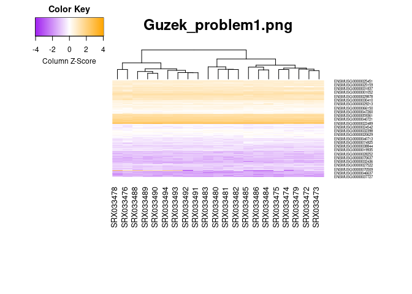
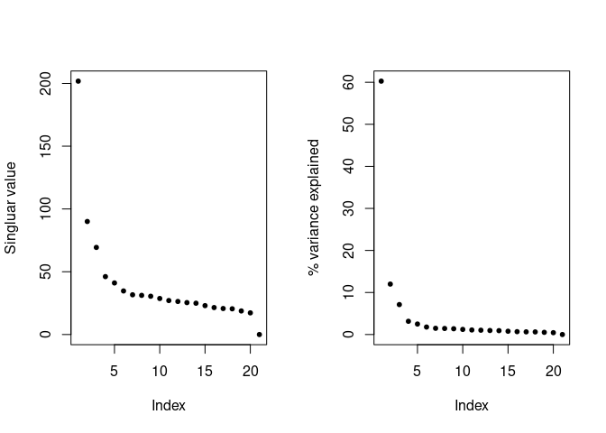
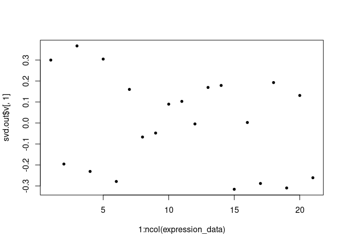
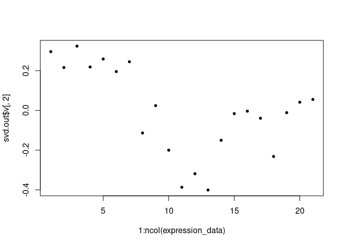
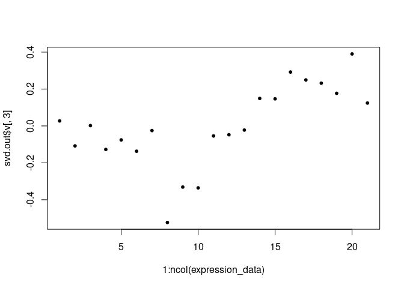
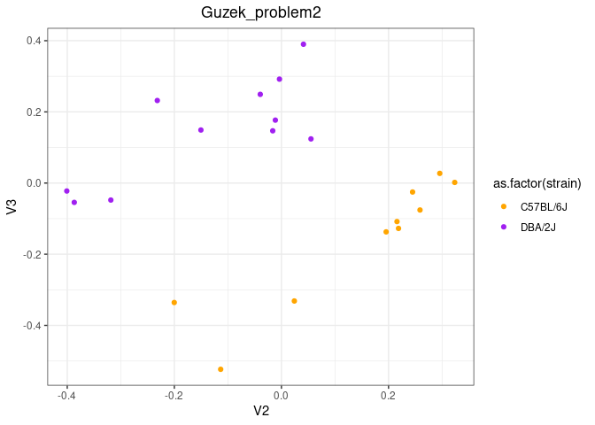
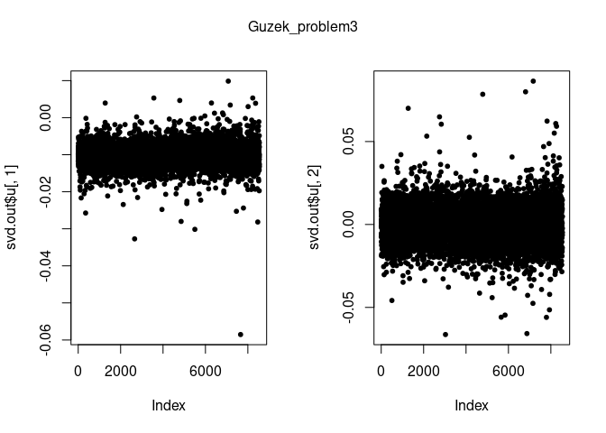
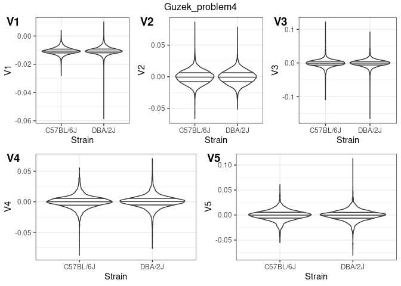
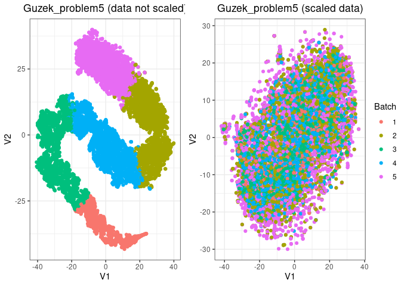

## Dependencies and setup

Load the dependencies.

Set theme for the plots

    theme_set(theme_bw())
    theme_update(plot.title = element_text(hjust = 0.5))

Set the colors

    colors <- colorRampPalette(c("purple", "white", "orange"))(n = 500)

## Initialize the data

As a first step let’s download the mouse RNA-seq data.

    if (file_test("-f", "./bottomly.Rdata")) {
      load(file = "./bottomly.Rdata")
    } else {
      con <- url("http://bowtie-bio.sourceforge.net/recount/ExpressionSets/bottomly_eset.RData")
      load(file = con)
      close(con)
      save(bottomly.eset, file = "bottomly.Rdata")
    }

Initialize the expression data as a matrix

    expression_data <- as.matrix(exprs(bottomly.eset))
    dim(expression_data)

    ## [1] 36536    21

    expression_data[1:10, 1:5] # take a look at the data

    ##                    SRX033480 SRX033488 SRX033481 SRX033489 SRX033482
    ## ENSMUSG00000000001       369       744       287       769       348
    ## ENSMUSG00000000003         0         0         0         0         0
    ## ENSMUSG00000000028         0         1         0         1         1
    ## ENSMUSG00000000031         0         0         0         0         0
    ## ENSMUSG00000000037         0         1         1         5         0
    ## ENSMUSG00000000049         0         1         0         1         0
    ## ENSMUSG00000000056        21        46        20        36        12
    ## ENSMUSG00000000058        15        43        12        34        14
    ## ENSMUSG00000000078       517       874       340       813       378
    ## ENSMUSG00000000085         0         0         0         0         0

    expression_data <- expression_data[rowMeans(expression_data) > 10, ]
    expression_data <- log2(as.matrix(expression_data) + 1)

## Problem 1

> *Homework Problem 1:* Make one heatmap of the aforementioned Bottomly
> data with the following options: a) both rows and columns are
> clustered, b) show a dendrogram only on the columns., and c) scale in
> the column direction. Send only one heatmap. If you are unsure, check
> the help document on this function by typing ?heatmap.2

Create a heatmap for homework problem 1

    #png("Guzek_problem1.png", height = 700, width = 700)
    heatmap.2(expression_data,
      # Should be clustered both by columns and rows by default
      main = "Guzek_problem1.png",
      notecol = "black",
      density.info = "none",
      trace = "none",
      margin = c(12, 9),
      col = colors,
      dendrogram = "column", # Draw dendrogram only for columns
      scale = "column", # Scale heatmap in the column direction
    )

    #dev.off()

## Homework problem 2

> *Homework Problem 2:* As shown in the plot above, the projection on
> the top 2 PCs doesn’t show the grouping by the strains. But we have
> many PCs to explore. Explore different combinations of PCs in scatter
> plots while coloring the data points by the genetic strains. Find a
> combination of PCs that separate the strains well. Send only one
> scatterplot.

Let’s start by running SVD on our data

    svd.out <- svd(t(scale(t(expression_data), scale = FALSE, center = TRUE)))
    print(paste("Dimension of left singular vectors:", dim(svd.out$u)))

    ## [1] "Dimension of left singular vectors: 8544"
    ## [2] "Dimension of left singular vectors: 21"

    print(paste("Length of singular values:", length(svd.out$d)))

    ## [1] "Length of singular values: 21"

    print(paste("Dimension of right singular vectors:", dim(svd.out$v)))

    ## [1] "Dimension of right singular vectors: 21"
    ## [2] "Dimension of right singular vectors: 21"

Plot singular value to determine which PCAs are important.

    par(mfrow = c(1, 2))
    plot(svd.out$d, pch = 20, ylab = "Singluar value")
    plot(svd.out$d^2 / sum(svd.out$d^2) * 100, pch = 20, ylab = "% variance explained")

Let’s look at top right vectors.

    plot(1:ncol(expression_data), svd.out$v[, 1], pch = 20)

    plot(1:ncol(expression_data), svd.out$v[, 2], pch = 20)

    plot(1:ncol(expression_data), svd.out$v[, 3], pch = 20)

Let’s plot the actual PCA’s

    PC <- data.table(svd.out$v, pData(bottomly.eset))

    #pdf("Guzek_problem2.pdf", width = 8, height = 5)
    # I tried creating those plots in a for loop but it didn't work for some reason
    # ggplot(PC) +  geom_point(aes(x=V1, y=V2, col=as.factor(strain)))
    # ggplot(PC) +  geom_point(aes(x=V1, y=V3, col=as.factor(strain))) # goodish separation
    # ggplot(PC) +  geom_point(aes(x=V1, y=V4, col=as.factor(strain)))
    # ggplot(PC) +  geom_point(aes(x=V1, y=V5, col=as.factor(strain)))
    # ggplot(PC) +  geom_point(aes(x=V1, y=V6, col=as.factor(strain)))
    ggplot(PC) +
      geom_point(aes(x = V2, y = V3, col = as.factor(strain))) +
      scale_color_manual(values = c("orange", "purple")) +
      labs(title = "Guzek_problem2") # best separation

    # ggplot(PC) +  geom_point(aes(x=V2, y=V4, col=as.factor(strain)))
    # ggplot(PC) +  geom_point(aes(x=V2, y=V5, col=as.factor(strain)))
    # ggplot(PC) +  geom_point(aes(x=V2, y=V6, col=as.factor(strain)))
    # ggplot(PC) +  geom_point(aes(x=V3, y=V4, col=as.factor(strain)))
    # ggplot(PC) +  geom_point(aes(x=V3, y=V5, col=as.factor(strain))) # goodish separation
    # ggplot(PC) +  geom_point(aes(x=V3, y=V6, col=as.factor(strain)))
    # ggplot(PC) +  geom_point(aes(x=V4, y=V5, col=as.factor(strain)))
    # ggplot(PC) +  geom_point(aes(x=V4, y=V6, col=as.factor(strain)))
    # ggplot(PC) +  geom_point(aes(x=V5, y=V6, col=as.factor(strain)))
    #dev.off()

## Homework problem 3

> *Homework Problem 3:* Make a scatter plot of the top 2 left singular
> vectors.

Top two left singular vectors.

    #pdf("Guzek_problem3.pdf", width = 16, height = 9)
    par(mfrow = c(1, 2))
    plot(svd.out$u[, 1], pch = 20)
    plot(svd.out$u[, 2], pch = 20)
    mtext("Guzek_problem3", side = 3, line = -2, outer = TRUE)

    #dev.off()

## Homework problem 4

> *Homework Problem 4:* Make one figure that contains violin plots of
> the top 5 left singular vectors (loadings). Hint/To-do: Make sure turn
> the top 5 left singular vectors into a data.table (or a data.frame)
> and ggplot2 to plot them altogether. Do not send 5 figures!

Violin plots for the top 5 left singular vectors.

    loadings <- data.table(svd.out$u, pData(bottomly.eset))

    ## Warning in as.data.table.list(x, keep.rownames = keep.rownames, check.names =
    ## check.names, : Item 2 has 21 rows but longest item has 8544; recycled with
    ## remainder.

    #png("Guzek_problem4.png", width = 800, height = 500)
    V1 <- ggplot(loadings) +
      geom_violin(aes(x = as.factor(strain), y = V1), draw_quantiles = c(0.25, 0.50, 0.75)) +
      xlab("Strain")
    V2 <- ggplot(loadings) +
      geom_violin(aes(x = as.factor(strain), y = V2), draw_quantiles = c(0.25, 0.50, 0.75)) +
      xlab("Strain")
    V3 <- ggplot(loadings) +
      geom_violin(aes(x = as.factor(strain), y = V3), draw_quantiles = c(0.25, 0.50, 0.75)) +
      xlab("Strain")
    V4 <- ggplot(loadings) +
      geom_violin(aes(x = as.factor(strain), y = V4), draw_quantiles = c(0.25, 0.50, 0.75)) +
      xlab("Strain")
    V5 <- ggplot(loadings) +
      geom_violin(aes(x = as.factor(strain), y = V5), draw_quantiles = c(0.25, 0.50, 0.75)) +
      xlab("Strain")
    figure <- ggarrange(ggarrange(V1, V2, V3, labels = c("V1", "V2", "V3"), ncol = 3, nrow = 1), ggarrange(V4, V5, labels = c("V4", "V5"), ncol = 2, nrow = 1), ncol = 1, nrow = 2) + labs(title="Guzek_problem4")
    annotate_figure(figure, top = text_grob("Guzek_problem4"))

    #dev.off()

## Homework problem 5

> *Homework Problem 5:* Cluster the genes (rows) using K-means
> clustering (function `kmeans()`) on the original data, with `k=5`
> clusters. Then, create a 2-dimensional t-SNE projection (as done
> previously) while using the 5 clusters to color the data points
> corresponding to genes.

Calculate the t-SNE for the expression data (scaled and not scaled).

    set.seed(1)
    scaled_edata <- t(scale(t(expression_data), scale = FALSE, center = TRUE))
    tsne_output.unscaled <- Rtsne(expression_data, pca = FALSE, preplexity = 60)
    tsne_output.unscaled <- data.table(tsne_output.unscaled$Y)
    tsne_output.scaled <- Rtsne(scaled_edata, pca = FALSE, preplexity = 60)
    tsne_output.scaled <- data.table(tsne_output.scaled$Y)

Cluster the data.

    clusters <- kmeans(expression_data, centers = 5)

Plot the t-SNE with highlighted clusters.

    #pdf("Guzek_problem5.pdf", width = 16, height = 5)
    tsne_clustered.unscaled <- data.table(expression_data, tsne_output.unscaled, keep.rownames = TRUE)
    tsne_clustered.scaled <- data.table(expression_data, tsne_output.scaled, keep.rownames = TRUE)
    tsne_plot.unscaled <- ggplot(tsne_clustered.unscaled) +
      geom_point(aes(x = V1, y = V2, col = as.factor(clusters$cluster))) +
      labs(title = ("Guzek_problem5 (data not scaled)"), color = "Batch")
    tsne_plot.scaled <- ggplot(tsne_clustered.scaled) +
      geom_point(aes(x = V1, y = V2, col = as.factor(clusters$cluster))) +
      labs(title = ("Guzek_problem5 (scaled data)"), color = "Batch")
    figure <- ggarrange(tsne_plot.unscaled, tsne_plot.scaled, ncol = 2, nrow = 1, common.legend = TRUE, legend = "right")
    figure

    #dev.off()
